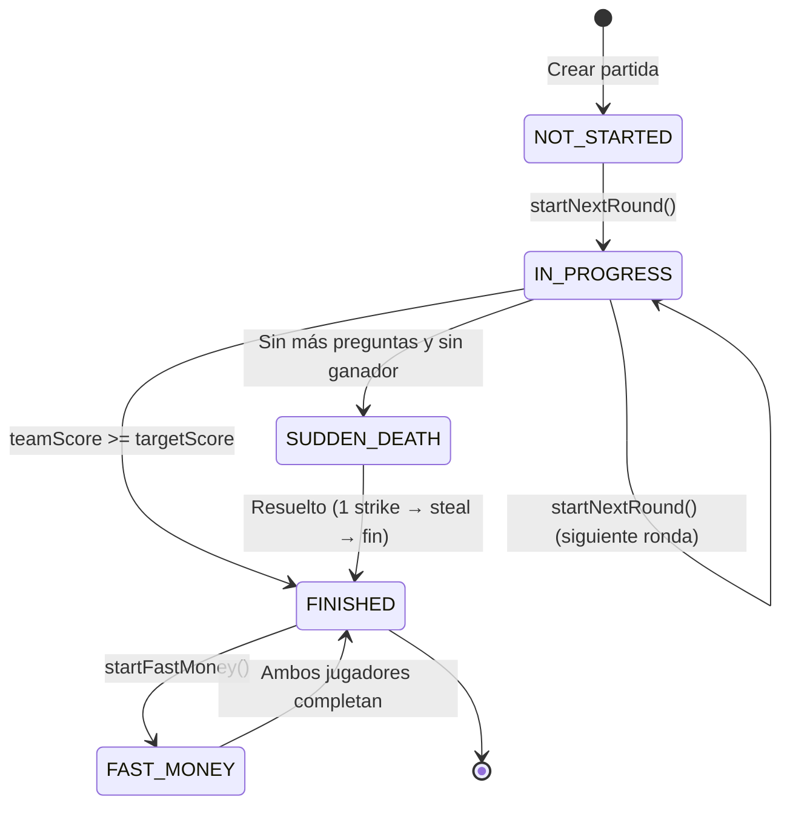
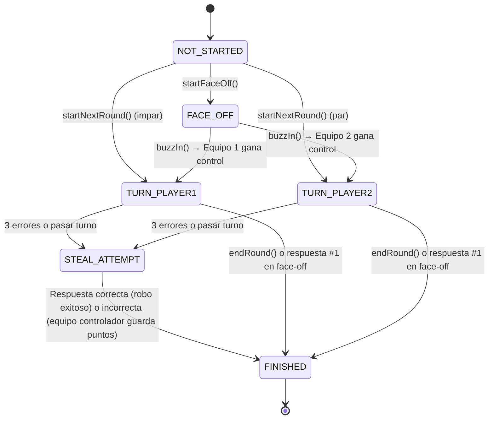
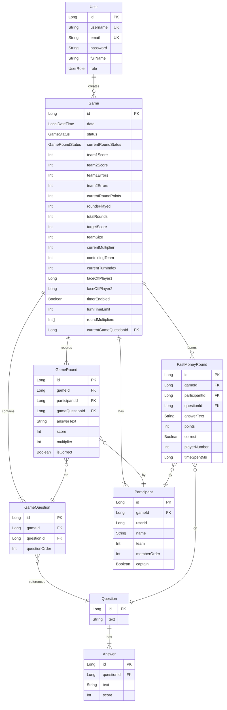
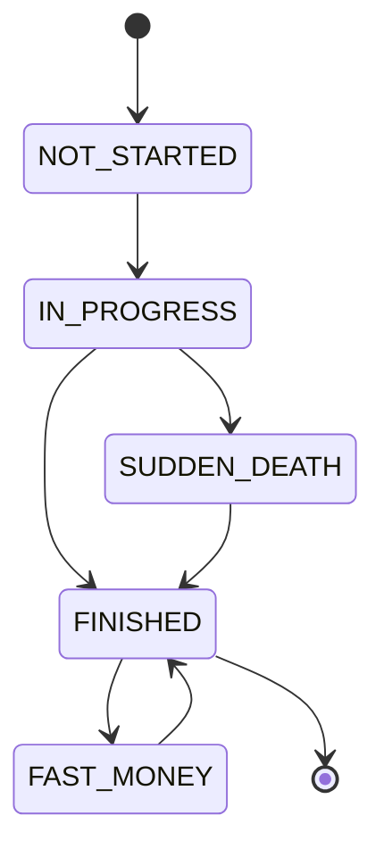
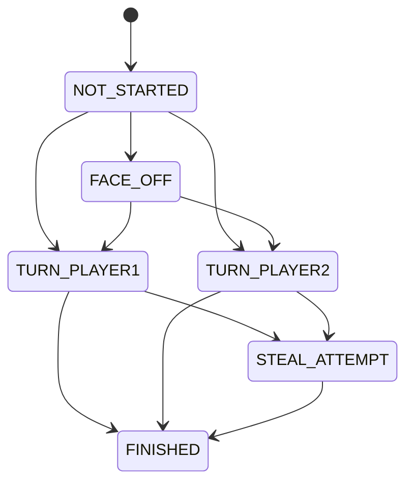
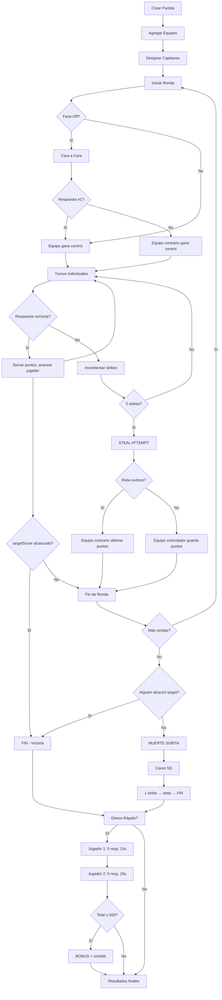

# Documentación — 100 Mexicanos Dijeron

> Guía técnica completa del proyecto. Backend, Frontend, Base de Datos, Infraestructura.

---

## Tabla de Contenidos

1. [Introducción](#1-introducción)
2. [Diagrama de Estado General](#2-diagrama-de-estado-general)
3. [Arquitectura y Paquetes](#3-arquitectura-y-paquetes)
4. [Entidades (JPA)](#4-entidades-jpa)
5. [DTOs](#5-dtos)
6. [Enums](#6-enums)
7. [Controladores REST](#7-controladores-rest)
8. [Controladores Thymeleaf (Web MVC)](#8-controladores-thymeleaf-web-mvc)
9. [Servicios](#9-servicios)
10. [Repositorios](#10-repositorios)
11. [Mappers (MapStruct)](#11-mappers-mapstruct)
12. [Configuración](#12-configuración)
13. [Excepciones Personalizadas](#13-excepciones-personalizadas)
14. [Conversores](#14-conversores)
15. [Lógica del Juego — Flujo Completo](#15-lógica-del-juego--flujo-completo)
16. [WebSocket — Eventos en Tiempo Real](#16-websocket--eventos-en-tiempo-real)
17. [Base de Datos](#17-base-de-datos)
18. [Stack Frontend](#18-stack-frontend)
19. [Templates (Páginas)](#19-templates-páginas)
20. [JavaScript](#20-javascript)
21. [CSS (style.css)](#21-css-stylecss)
22. [CDN Libraries](#22-cdn-libraries)
23. [Flujo de Navegación](#23-flujo-de-navegación)
24. [Configuración por Perfil](#24-configuración-por-perfil)
25. [Infraestructura](#25-infraestructura)
26. [Pruebas](#26-pruebas)
27. [Inicio Rápido](#27-inicio-rápido)

---

## 1. Introducción

**100MD-app** es la API backend + frontend del juego *"100 Mexicanos Dijeron"*, la versión mexicana del formato televisivo internacionalmente conocido como:

| País | Nombre |
|------|--------|
| 🇺🇸 Estados Unidos | Family Feud |
| 🇲🇽 México | 100 Mexicanos Dijeron |
| 🇦🇷 Argentina | 100 argentinos dicen |
| 🌍 Internacional | 100 to 1 |

Dos equipos compiten adivinando las respuestas más populares a preguntas de encuesta. Gana el equipo que acumule más puntos tras una serie de rondas.

### Stack Tecnológico

| Capa | Tecnología | Versión |
|------|-----------|---------|
| Lenguaje | Java | 17.0.12 |
| Framework | Spring Boot | 3.3.5 |
| Build | Maven (mvnw) | — |
| Base de datos | MySQL (dev/prod) / H2 (tests) | 8.0 |
| ORM | Spring Data JPA (Hibernate) | — |
| Mapeo DTO | MapStruct | 1.5.5 |
| Boilerplate | Lombok | 1.18.34 |
| Seguridad | Spring Security | 6 |
| Templates | Thymeleaf | — |
| Frontend | Alpine.js + Bootstrap 5 | 3.14.1 / 5.3.2 |
| Tiempo real | Spring WebSocket + STOMP + SockJS | — |
| API docs | Springdoc OpenAPI | 2.2.0 |
| Migraciones | Flyway | 13 versiones |
| Audio | Web Audio API | — |
| Confetti | canvas-confetti | 1.9.3 |

### Modelo de Negocio

- **Host-control:** Un host administra el juego, los espectadores ven en tiempo real.
- **2 equipos** de hasta 5 miembros cada uno.
- **5 rondas** con multiplicadores x1, x1, x2, x2, x3.
- **Target score:** 300 puntos para ganar (detecta victoria mid-game).
- **Muerte Súbita:** tiebreaker si hay empate después de 5 rondas.
- **Dinero Rápido:** ronda de bonificación post-juego.

### Estadísticas del Proyecto

| Categoría | Archivos | Líneas |
|-----------|----------|--------|
| Java source | 80 | 3,606 |
| Java tests | 2 | 135 |
| HTML templates | 9 | 2,102 |
| CSS | 1 | 1,132 |
| JavaScript | 3 | 370 |
| SQL migrations | 13 | 241 |
| Config | 8 | 146 |
| **Total** | **~116** | **~7,732** |

---

## 2. Diagrama de Estado General

### Máquina de Estados del Juego



### Máquina de Estados de la Ronda



### Diagrama Entidad-Relación



---

## PARTE BACKEND

## 3. Arquitectura y Paquetes

### Estructura de Paquetes

```
com.AlanPacheco.CienMD_app/
├── Application.java                    # Entry point (@SpringBootApplication)
├── Config/                             # Configuración del framework (8 archivos)
├── Controller/                         # Endpoints REST + Thymeleaf (10 archivos)
├── Service/                            # Lógica de negocio (5 archivos)
├── Entity/                             # Modelos JPA (8 archivos)
├── DTO/                                # Data Transfer Objects (18 archivos)
├── Repository/                         # Acceso a datos (8 archivos)
├── Mapper/                             # Mapeo Entity ↔ DTO (6 archivos)
├── Enum/                               # Enumeraciones (3 archivos)
├── Exception/                          # Excepciones personalizadas (5 archivos)
└── Converter/                          # AttributeConverters (1 archivo)
```

### Responsabilidades por Paquete

| Paquete | Responsabilidad | Archivos |
|---------|----------------|----------|
| `Config` | Configuración de seguridad, WebSocket, CORS, manejo de errores global, datos iniciales, eventos | 8 |
| `Controller` | Endpoints REST (API JSON) y controladores Thymeleaf (vistas HTML) | 10 |
| `Service` | Toda la lógica de negocio. GameService es el corazón (1,092 líneas) | 5 |
| `Entity` | Modelos JPA con anotaciones Hibernate, relaciones y constrains | 8 |
| `DTO` | Objetos de transferencia para API y WebSocket. Separan internals de la API | 18 |
| `Repository` | Interfaces Spring Data JPA con queries custom y JPQL | 8 |
| `Mapper` | Conversión automática Entity ↔ DTO vía MapStruct (compile-time) | 6 |
| `Enum` | Estados del juego, estados de ronda, roles de usuario | 3 |
| `Exception` | Excepciones de dominio (5 tipos) | 5 |
| `Converter` | Conversores JPA AttributeConverter para tipos personalizados | 1 |

### Flujo de una Petición

```
HTTP Request → Controller (valida input, llama Service)
                    ↓
              Service (lógica de negocio, usa Repository)
                    ↓
              Repository (queries a la base de datos)
                    ↓
              Entity (JPA maps to MySQL/H2)
                    ↓
              Service (convierte Entity → DTO vía Mapper)
                    ↓
              Controller (retorna DTO como JSON o Thymeleaf view)
```

### Líneas de Código por Capa

```
Service:      1,540 líneas  ████████████████████████████████ (43%)
Controller:     606 líneas  ████████████ (17%)
Entity:         316 líneas  ██████ (9%)
DTO:            323 líneas  ██████ (9%)
Config:         244 líneas  █████ (7%)
Mapper:         126 líneas  ██ (4%)
Repository:     130 líneas  ██ (4%)
Converter:       36 líneas  █ (1%)
Enum:            25 líneas  ▌ (1%)
Exception:       35 líneas  ▌ (1%)
Application:     13 líneas  ▌ (<1%)
────────────────────────────────────────────────────────
TOTAL:         3,394 líneas Java (sin tests)
```

---

## 4. Entidades (JPA)

### 4.1 Game (tabla: `games`)

Entidad raíz del agregado. Representa una partida completa.

| Campo | Tipo | Anotaciones | Default |
|-------|------|-------------|---------|
| `id` | `Long` | `@Id @GeneratedValue(IDENTITY)` | — |
| `date` | `LocalDateTime` | `@Column(nullable=false)` | — |
| `status` | `GameStatus` | `@Enumerated(STRING)` | — |
| `currentRoundStatus` | `GameRoundStatus` | `@Enumerated(STRING)` | — |
| `team1Score` | `int` | `@Column(nullable=false)` | — |
| `team2Score` | `int` | `@Column(nullable=false)` | — |
| `team1Errors` | `int` | `@Column(nullable=false)` | — |
| `team2Errors` | `int` | `@Column(nullable=false)` | — |
| `currentRoundPoints` | `int` | `@Column(nullable=false)` | `0` |
| `roundsPlayed` | `int` | `@Column(nullable=false)` | `0` |
| `totalRounds` | `int` | `@Column(nullable=false)` | `5` |
| `targetScore` | `int` | `@Column(nullable=false)` | `300` |
| `teamSize` | `int` | `@Column(nullable=false)` | `5` |
| `currentMultiplier` | `int` | `@Column(nullable=false)` | `1` |
| `controllingTeam` | `Integer` | `@Column(nullable=true)` | `null` |
| `currentTurnIndex` | `int` | `@Column(nullable=false)` | `0` |
| `faceOffPlayer1` | `Long` | `@Column(nullable=true)` | — |
| `faceOffPlayer2` | `Long` | `@Column(nullable=true)` | — |
| `timerEnabled` | `boolean` | `@Column(nullable=false)` | `true` |
| `turnTimeLimit` | `int` | `@Column(nullable=false)` | `10` |
| `roundMultipliers` | `int[]` | `@Convert(IntArrayConverter.class)` | `{1,1,2,2,3}` |
| `currentGameQuestion` | `GameQuestion` | `@ManyToOne(LAZY)` | — |
| `participants` | `List<Participant>` | `@OneToMany(mappedBy, LAZY, ALL)` | `new ArrayList<>()` |
| `gameQuestions` | `List<GameQuestion>` | `@OneToMany(mappedBy, LAZY, ALL)` | `new ArrayList<>()` |

### 4.2 Question (tabla: `questions`)

Una pregunta de encuesta que aparece en el juego.

| Campo | Tipo | Anotaciones |
|-------|------|-------------|
| `id` | `Long` | `@Id @GeneratedValue(IDENTITY)` |
| `text` | `String` | `@Column(nullable=false)` |
| `answers` | `List<Answer>` | `@OneToMany(mappedBy, LAZY, ALL)` |

### 4.3 Answer (tabla: `answers`)

Una posible respuesta con su puntaje de encuesta.

| Campo | Tipo | Anotaciones |
|-------|------|-------------|
| `id` | `Long` | `@Id @GeneratedValue(IDENTITY)` |
| `question` | `Question` | `@ManyToOne(LAZY)` |
| `text` | `String` | `@Column(nullable=false)` |
| `score` | `int` | `@Column(nullable=false)` |

### 4.4 GameQuestion (tabla: `game_questions`)

Entidad puente que vincula un Game con un Question, incluyendo el orden de la pregunta en la partida.

| Campo | Tipo | Anotaciones |
|-------|------|-------------|
| `id` | `Long` | `@Id @GeneratedValue(IDENTITY)` |
| `game` | `Game` | `@ManyToOne(LAZY)` |
| `question` | `Question` | `@ManyToOne(LAZY)` |
| `questionOrder` | `int` | `@Column(nullable=false)` |

### 4.5 Participant (tabla: `participants`)

Un jugador dentro de una partida.

| Campo | Tipo | Anotaciones | Default |
|-------|------|-------------|---------|
| `id` | `Long` | `@Id @GeneratedValue(IDENTITY)` | — |
| `game` | `Game` | `@ManyToOne(LAZY)` | — |
| `userId` | `Long` | `@Column` | — |
| `name` | `String` | `@Column(nullable=false)` | — |
| `team` | `int` | `@Column(nullable=false)` | `1` |
| `memberOrder` | `int` | `@Column(nullable=false)` | `0` |
| `captain` | `boolean` | `@Column(nullable=false)` | `false` |

### 4.6 GameRound (tabla: `game_rounds`)

Registra cada intento de respuesta dentro de una ronda.

| Campo | Tipo | Anotaciones |
|-------|------|-------------|
| `id` | `Long` | `@Id @GeneratedValue(IDENTITY)` |
| `game` | `Game` | `@ManyToOne(LAZY)` |
| `participant` | `Participant` | `@ManyToOne(LAZY)` |
| `gameQuestion` | `GameQuestion` | `@ManyToOne(LAZY)` |
| `answerText` | `String` | `@Column(nullable=false)` |
| `score` | `int` | `@Column(nullable=false)` |
| `multiplier` | `int` | `@Column(nullable=false)` |
| `isCorrect` | `boolean` | `@Column(nullable=false)` |

### 4.7 FastMoneyRound (tabla: `fast_money_rounds`)

Registra las respuestas del Dinero Rápido.

| Campo | Tipo | Anotaciones | Default |
|-------|------|-------------|---------|
| `id` | `Long` | `@Id @GeneratedValue(IDENTITY)` | — |
| `game` | `Game` | `@ManyToOne(LAZY)` | — |
| `participant` | `Participant` | `@ManyToOne(LAZY)` | — |
| `question` | `Question` | `@ManyToOne(LAZY)` | — |
| `answerText` | `String` | `@Column(length=300)` | — |
| `points` | `int` | `@Column(nullable=false)` | `0` |
| `correct` | `boolean` | `@Column(nullable=false)` | `false` |
| `playerNumber` | `int` | `@Column(nullable=false)` | — |
| `timeSpentMs` | `long` | `@Column(nullable=false)` | `0` |

### 4.8 User (tabla: `users`)

Usuarios del sistema con autenticación.

| Campo | Tipo | Anotaciones | Default |
|-------|------|-------------|---------|
| `id` | `Long` | `@Id @GeneratedValue(IDENTITY)` | — |
| `username` | `String` | `@Column(unique, length=50)` | — |
| `email` | `String` | `@Column(unique, length=100)` | — |
| `password` | `String` | `@Column(nullable=false)` | — |
| `fullName` | `String` | `@Column(length=100)` | — |
| `role` | `UserRole` | `@Enumerated(STRING)` | `PLAYER` |
| `createdAt` | `LocalDateTime` | `@Column` | — |
| `updatedAt` | `LocalDateTime` | `@Column` | — |

---

## 5. DTOs

### 5.1 GameDTO

Objeto completo del estado de una partida. Se envía al cliente vía REST y WebSocket.

| Campo | Tipo | Descripción |
|-------|------|-------------|
| `id` | `Long` | ID de la partida |
| `date` | `LocalDateTime` | Fecha de creación |
| `status` | `String` | Estado del juego (enum como String) |
| `currentRoundStatus` | `String` | Estado de la ronda actual |
| `team1Score` | `int` | Puntaje equipo 1 |
| `team2Score` | `int` | Puntaje equipo 2 |
| `team1Errors` | `int` | Errores acumulados equipo 1 |
| `team2Errors` | `int` | Errores acumulados equipo 2 |
| `currentRoundPoints` | `int` | Puntos acumulados en la ronda actual |
| `roundsPlayed` | `int` | Rondas completadas |
| `totalRounds` | `int` | Total de rondas configuradas |
| `currentMultiplier` | `int` | Multiplicador de la ronda actual |
| `controllingTeam` | `Integer` | Equipo con control (1 o 2, null si ninguno) |
| `targetScore` | `int` | Puntaje para ganar |
| `roundMultipliers` | `int[]` | Array de multiplicadores por ronda |
| `currentTurnIndex` | `int` | Índice del jugador activo |
| `timerEnabled` | `boolean` | Si el timer está habilitado |
| `turnTimeLimit` | `int` | Segundos por turno |
| `winner` | `String` | Ganador ("team1", "team2", "draw") |
| `currentQuestionId` | `Long` | ID de la pregunta actual |
| `gameQuestionText` | `String` | Texto de la pregunta actual |
| `currentAnswers` | `List<AnswerDTO>` | Respuestas de la pregunta actual |
| `faceOffPlayer1` | `Long` | ID del jugador 1 en face-off |
| `faceOffPlayer2` | `Long` | ID del jugador 2 en face-off |

### 5.2 CreateGameDTO

Input para crear una nueva partida. Todos los campos son opcionales con valores por defecto.

| Campo | Tipo | Validación | Default |
|-------|------|-----------|---------|
| `totalRounds` | `int` | `@Min(2) @Max(10)` | `5` |
| `multipliers` | `int[]` | — | `{1,1,2,2,3}` |
| `teamSize` | `int` | `@Min(2) @Max(5)` | `5` |
| `targetScore` | `int` | `@Min(100) @Max(9999)` | `300` |
| `timerEnabled` | `boolean` | — | `true` |
| `turnTimeLimit` | `int` | `@Min(5) @Max(60)` | `10` |

### 5.3 GameUpdateDTO

Payload que se envía por WebSocket con cada actualización.

| Campo | Tipo | Descripción |
|-------|------|-------------|
| `event` | `String` | Nombre del evento (ej: "ANSWER_CORRECT") |
| `game` | `GameDTO` | Estado completo de la partida |

### 5.4 GameResultsDTO

Resultados finales de una partida terminada.

| Campo | Tipo | Descripción |
|-------|------|-------------|
| `gameId` | `Long` | ID de la partida |
| `status` | `String` | Estado final |
| `team1Score` | `int` | Puntaje final equipo 1 |
| `team2Score` | `int` | Puntaje final equipo 2 |
| `participants` | `List<ParticipantDTO>` | Todos los participantes con scores |
| `winner` | `String` | "team1", "team2" o "draw" |

### 5.5 GameHistoryDTO

Resumen para el listado de historial.

| Campo | Tipo | Descripción |
|-------|------|-------------|
| `id` | `Long` | ID de la partida |
| `date` | `String` | Fecha formateada `dd/MM/yyyy HH:mm` |
| `status` | `String` | Estado |
| `team1Score` | `int` | Puntaje equipo 1 |
| `team2Score` | `int` | Puntaje equipo 2 |
| `winner` | `String` | "Equipo 1", "Equipo 2" o "Empate" |
| `totalRounds` | `int` | Total de rondas jugadas |

### 5.6 ParticipantDTO

| Campo | Tipo | Descripción |
|-------|------|-------------|
| `id` | `Long` | ID del participante |
| `name` | `String` | Nombre |
| `team` | `int` | Número de equipo (1 o 2) |
| `score` | `int` | Puntaje acumulado (calculado) |
| `captain` | `boolean` | Si es capitán |

### 5.7 CreateParticipantDTO

| Campo | Tipo | Validación | Default |
|-------|------|-----------|---------|
| `name` | `String` | `@NotBlank` | — |
| `team` | `int` | — | `1` |

### 5.8 QuestionDTO

| Campo | Tipo |
|-------|------|
| `id` | `Long` |
| `text` | `String` |
| `answers` | `List<AnswerDTO>` |

### 5.9 AnswerDTO

| Campo | Tipo | Descripción |
|-------|------|-------------|
| `id` | `Long` | ID de la respuesta |
| `text` | `String` | Texto de la respuesta |
| `score` | `int` | Puntaje base |
| `revealed` | `boolean` | Si fue revelada en el tablero |

### 5.10 GameQuestionDTO

| Campo | Tipo |
|-------|------|
| `id` | `Long` |
| `questionText` | `String` |
| `answers` | `List<AnswerDTO>` |

### 5.11 RoundDTO

Input para enviar una respuesta durante una ronda.

| Campo | Tipo | Validación |
|-------|------|-----------|
| `participantId` | `Long` | — |
| `gameQuestionId` | `Long` | — |
| `answerText` | `String` | — |
| `roundMultiplier` | `int` | `@Min(1)` default `1` |

### 5.12 BuzzInDTO

Input para el buzzer del face-off.

| Campo | Tipo |
|-------|------|
| `participantId` | `Long` |
| `answerText` | `String` |

### 5.13 FastMoneyDTO

Estado completo del Dinero Rápido.

| Campo | Tipo | Descripción |
|-------|------|-------------|
| `gameId` | `Long` | ID de la partida |
| `status` | `String` | Estado del fast money |
| `player1Id` | `Long` | ID jugador 1 |
| `player2Id` | `Long` | ID jugador 2 |
| `player1Name` | `String` | Nombre jugador 1 |
| `player2Name` | `String` | Nombre jugador 2 |
| `player1TotalPoints` | `int` | Total puntos jugador 1 |
| `player2TotalPoints` | `int` | Total puntos jugador 2 |
| `combinedTotal` | `int` | Total combinado |
| `wonBonus` | `boolean` | Si ganaron el bonus (>=200) |
| `bonusTarget` | `int` | Meta del bonus (200) |
| `player1Answers` | `List<FastMoneyAnswerDTO>` | Respuestas jugador 1 |
| `player2Answers` | `List<FastMoneyAnswerDTO>` | Respuestas jugador 2 |
| `questions` | `List<String>` | Textos de las 5 preguntas |

### 5.14 FastMoneyAnswerDTO

| Campo | Tipo |
|-------|------|
| `question` | `String` |
| `answer` | `String` |
| `points` | `int` |
| `correct` | `boolean` |

### 5.15 FastMoneySubmissionDTO

| Campo | Tipo | Descripción |
|-------|------|-------------|
| `participantId` | `Long` | ID del jugador que responde |
| `answers` | `List<String>` | 5 respuestas |
| `timeSpentMs` | `long` | Tiempo empleado (ms) |

### 5.16 PlayerStatsDTO

| Campo | Tipo | Descripción |
|-------|------|-------------|
| `playerName` | `String` | Nombre del jugador |
| `gamesPlayed` | `long` | Partidas jugadas |
| `totalScore` | `int` | Puntaje total |
| `averageScore` | `double` | Promedio por partida |
| `correctAnswers` | `long` | Respuestas correctas |
| `wrongAnswers` | `long` | Respuestas incorrectas |

### 5.17 RegisterDTO

| Campo | Tipo | Validación |
|-------|------|-----------|
| `username` | `String` | `@Size(min=3, max=50)` |
| `email` | `String` | `@Email` |
| `password` | `String` | `@Size(min=6)` |
| `fullName` | `String` | — |

### 5.18 ErrorResponse

| Campo | Tipo |
|-------|------|
| `code` | `String` |
| `message` | `String` |

---

## 6. Enums

### 6.1 GameStatus

Estado global de una partida.

| Valor | Descripción |
|-------|-------------|
| `NOT_STARTED` | Partida creada, agregando participantes |
| `IN_PROGRESS` | Rondas en curso |
| `SUDDEN_DEATH` | Muerte súbita (empate tras rondas normales) |
| `FAST_MONEY` | Dinero rápido (ronda de bonificación) |
| `FINISHED` | Partida terminada |



### 6.2 GameRoundStatus

Estado de la ronda actual.

| Valor | Descripción |
|-------|-------------|
| `NOT_STARTED` | Antes de que comience la ronda |
| `FACE_OFF` | Dos jugadores de equipos opuestos hacen buzzer |
| `SUDDEN_DEATH_FACE_OFF` | Careo en muerte súbita |
| `TURN_PLAYER1` | Equipo 1 está jugando |
| `TURN_PLAYER2` | Equipo 2 está jugando |
| `STEAL_ATTEMPT` | Equipo contrario intenta robar |
| `FINISHED` | Ronda terminada |



### 6.3 UserRole

| Valor | Descripción |
|-------|-------------|
| `ADMIN` | Administrador (acceso al panel de admin) |
| `PLAYER` | Jugador regular |

---

## 7. Controladores REST

### 7.1 GameController (`/api/games`)

El controlador principal con 17 endpoints.

| Método | Ruta | Descripción | Parámetros |
|--------|------|-------------|------------|
| `POST` | `/api/games` | Crear partida nueva | Body: `CreateGameDTO` |
| `GET` | `/api/games` | Listar todas las partidas | — |
| `GET` | `/api/games/{id}` | Obtener partida por ID | `id` |
| `GET` | `/api/games/{gameId}/results` | Resultados finales | `gameId` |
| `GET` | `/api/games/{gameId}/questions/{questionId}` | Pregunta con respuestas reveladas | `gameId`, `questionId` |
| `POST` | `/api/games/{gameId}/rounds/start` | Iniciar siguiente ronda | `gameId` |
| `POST` | `/api/games/{gameId}/rounds/answer` | Enviar respuesta | `gameId`, Body: `RoundDTO` |
| `POST` | `/api/games/{gameId}/rounds/end` | Terminar ronda actual | `gameId` |
| `POST` | `/api/games/{gameId}/rounds/pass` | Pasar turno | `gameId` |
| `POST` | `/api/games/{gameId}/rounds/error` | Registrar error manual | `gameId` |
| `POST` | `/api/games/{gameId}/rounds/reveal/{answerId}` | Revelar respuesta del tablero | `gameId`, `answerId` |
| `POST` | `/api/games/{gameId}/participants/{participantId}/captain` | Designar capitán | `gameId`, `participantId` |
| `POST` | `/api/games/{gameId}/faceoff/start` | Iniciar cara a cara | `gameId`, Body: `{player1Id, player2Id}` |
| `POST` | `/api/games/{gameId}/faceoff/buzz` | Buzzer en cara a cara | `gameId`, Body: `BuzzInDTO` |
| `POST` | `/api/games/{gameId}/sudden-death/faceoff` | Careo en muerte súbita | `gameId`, Body: `{player1Id, player2Id}` |
| `POST` | `/api/games/{gameId}/sudden-death/buzz` | Buzzer en muerte súbita | `gameId`, Body: `{participantId, answerText}` |
| `POST` | `/api/games/{gameId}/sudden-death/answer` | Responder en muerte súbita | `gameId`, Body: `RoundDTO` |

### 7.2 FastMoneyController (`/api/games/{gameId}/fast-money`)

| Método | Ruta | Descripción | Body |
|--------|------|-------------|------|
| `POST` | `.../fast-money/start` | Iniciar Dinero Rápido | `{player1Id, player2Id}` |
| `POST` | `.../fast-money/submit` | Enviar respuestas | `FastMoneySubmissionDTO` |
| `GET` | `.../fast-money/status` | Estado actual | — |

### 7.3 QuestionController (`/api/questions`)

| Método | Ruta | Descripción |
|--------|------|-------------|
| `GET` | `/api/questions` | Listar todas las preguntas |
| `POST` | `/api/questions` | Crear pregunta (Body: `Question` entity) |

### 7.4 ParticipantController (`/api/games/{gameId}/participants`)

| Método | Ruta | Descripción | Body |
|--------|------|-------------|------|
| `POST` | `.../participants` | Agregar participante | `CreateParticipantDTO` |
| `GET` | `.../participants` | Listar participantes con scores | — |

### 7.5 RoundController (`/api/games/{gameId}/rounds`) — @Deprecated

| Método | Ruta | Descripción |
|--------|------|-------------|
| `POST` | `.../rounds` | Deprecated — usa `/rounds/answer` |
| `GET` | `.../rounds/results` | Obtener resultados finales |

### 7.6 GameWebSocketController (STOMP Message Mappings)

| Message Mapping | Descripción |
|----------------|-------------|
| `/app/game/{gameId}/answer` | Enviar respuesta vía WebSocket |
| `/app/game/{gameId}/start` | Iniciar siguiente ronda |
| `/app/game/{gameId}/end` | Terminar ronda |
| `/app/game/{gameId}/pass` | Pasar turno |

---

## 8. Controladores Thymeleaf (Web MVC)

Estos controladores sirven páginas HTML en vez de JSON.

### 8.1 AuthController

| Método | Ruta | Vista | Descripción |
|--------|------|-------|-------------|
| `GET` | `/login` | `login` | Página de login |
| `GET` | `/register` | `register` | Formulario de registro |
| `POST` | `/register` | redirect `/login?registered` | Procesar registro |

### 8.2 HomeController

| Método | Ruta | Vista | Descripción |
|--------|------|-------|-------------|
| `GET` | `/` | redirect `/dashboard` | Redirigir al dashboard |
| `GET` | `/dashboard` | `dashboard` | Dashboard con lista de partidas |
| `GET` | `/jugar/{id}` | `play` | Pantalla de juego |

### 8.3 AdminController

| Método | Ruta | Vista | Descripción |
|--------|------|-------|-------------|
| `GET` | `/admin/questions` | `admin/questions` | Lista de preguntas |
| `GET` | `/admin/questions/create` | `admin/question-form` | Formulario crear |
| `POST` | `/admin/questions/create` | redirect | Crear pregunta |
| `GET` | `/admin/questions/{id}/edit` | `admin/question-form` | Formulario editar |
| `POST` | `/admin/questions/{id}/edit` | redirect | Actualizar pregunta |
| `POST` | `/admin/questions/{id}/delete` | redirect | Eliminar pregunta |

### 8.4 StatsController

| Método | Ruta | Vista | Descripción |
|--------|------|-------|-------------|
| `GET` | `/history` | `history` | Historial de partidas |
| `GET` | `/stats` | `stats` | Estadísticas de jugadores |

---

## 9. Servicios

### 9.1 GameService (1,092 líneas — el corazón del sistema)

#### Métodos Públicos

| Método | Descripción |
|--------|-------------|
| `createNewGame(CreateGameDTO)` | Crea partida, valida preguntas suficientes, selecciona aleatoriamente |
| `getGameById(Long)` | Obtiene partida por ID |
| `getGameQuestion(Long gameId, Long questionId)` | Pregunta con estado de revelación |
| `startNextRound(Long)` | Avanza a siguiente ronda, asigna equipo controlador |
| `submitAnswer(Long, RoundDTO)` | Lógica principal de respuestas (correcta/incorrecta/steal) |
| `passTurn(Long)` | Pasa turno → STEAL_ATTEMPT |
| `incrementError(Long)` | Registra error manual, a las 3 → STEAL_ATTEMPT |
| `endRound(Long)` | Termina ronda, suma puntos al equipo controlador |
| `revealAnswer(Long, Long)` | Revela respuesta del tablero (host-control) |
| `getFinalResults(Long)` | Construye resultados finales |
| `getAllGames()` | Lista todas las partidas |
| `addParticipant(Long, CreateParticipantDTO)` | Agrega participante (solo NOT_STARTED) |
| `getParticipants(Long)` | Lista participantes con scores calculados |
| `setCaptain(Long, Long)` | Designa capitán (solo antes de iniciar) |
| `startFaceOff(Long, Long, Long)` | Inicia cara a cara |
| `buzzIn(Long, Long, String)` | Buzzer en face-off |
| `suddenDeathFaceOff(Long, Long, Long)` | Careo en muerte súbita |
| `suddenDeathBuzzIn(Long, Long, String)` | Buzzer en muerte súbita |
| `suddenDeathAnswer(Long, RoundDTO)` | Responder en muerte súbita (1 strike) |

#### Métodos Privados

| Método | Descripción |
|--------|-------------|
| `handleCorrectAnswer(...)` | Procesa respuesta correcta, acumula puntos |
| `handleIncorrectAnswer(...)` | Procesa respuesta incorrecta, incrementa errores |
| `checkForEarlyWin(Long)` | Verifica si algún equipo alcanzó targetScore |
| `advanceToNextPlayer(Long)` | Avanza al siguiente jugador del equipo |
| `toGameDTO(Game)` | Convierte Entity → DTO |
| `toGameQuestionDTO(GameQuestion)` | Convierte GameQuestion → DTO |
| `getCurrentAnswersForQuestion(Long)` | Obtiene respuestas de la pregunta actual |
| `getMultipliersForGame(Game)` | Obtiene array de multiplicadores |

### 9.2 FastMoneyService (248 líneas)

| Constante | Valor |
|-----------|-------|
| `BONUS_TARGET` | `200` |
| `QUESTIONS_COUNT` | `5` |

| Método | Descripción |
|--------|-------------|
| `startFastMoney(Long, Long, Long)` | Inicia Dinero Rápido, selecciona 5 preguntas nuevas |
| `submitAnswers(Long, FastMoneySubmissionDTO)` | Procesa respuestas de 1 jugador, previene duplicados |
| `getFastMoneyStatus(Long)` | Estado actual con totales por jugador |

### 9.3 QuestionService (94 líneas)

| Método | Descripción |
|--------|-------------|
| `getAllQuestions()` | Lista todas las preguntas con respuestas |
| `getQuestionById(Long)` | Obtiene una pregunta |
| `createQuestion(QuestionDTO)` | Crea pregunta + respuestas |
| `updateQuestion(Long, QuestionDTO)` | Actualiza pregunta (reemplaza respuestas) |
| `deleteQuestion(Long)` | Elimina respuestas + pregunta |

### 9.4 StatsService (67 líneas)

| Método | Descripción |
|--------|-------------|
| `getGameHistory()` | Historial de partidas ordenado por fecha |
| `getPlayerStats()` | Estadísticas agregadas por jugador |

### 9.5 UserService (39 líneas)

| Método | Descripción |
|--------|-------------|
| `register(String, String, String, String)` | Registra usuario con BCrypt, verifica duplicados |

---

## 10. Repositorios

### 10.1 GameRepository

| Método | Descripción |
|--------|-------------|
| `findAllByOrderByDateDesc()` | Todas las partidas ordenadas por fecha descendente |

### 10.2 GameQuestionRepository

| Método | Descripción |
|--------|-------------|
| `findByGameId(Long)` | Preguntas de una partida |
| `findQuestionIdsUsedOnDate(LocalDate)` | IDs de preguntas usadas en una fecha (JPQL) |

### 10.3 FastMoneyRoundRepository

| Método | Descripción |
|--------|-------------|
| `findByGameIdAndParticipantId(Long, Long)` | Rondas de un jugador en una partida |
| `findByGameIdAndPlayerNumber(Long, int)` | Rondas por número de jugador (1 o 2) |
| `sumPointsByGameIdAndParticipantId(Long, Long)` | Suma de puntos de un jugador (JPQL) |
| `sumAllPointsByGameId(Long)` | Suma total de puntos en una partida (JPQL) |
| `findCorrectAnswersByGameIdAndPlayerNumber(Long, int)` | Respuestas correctas para deduplicación (JPQL) |

### 10.4 AnswerRepository

| Método | Descripción |
|--------|-------------|
| `findByQuestionIdAndTextIgnoreCase(Long, String)` | Búsqueda case-insensitive de respuesta |
| `findByQuestionId(Long)` | Todas las respuestas de una pregunta (JPQL) |

### 10.5 ParticipantRepository

| Método | Descripción |
|--------|-------------|
| `findByGameId(Long)` | Participantes de una partida |

### 10.6 GameRoundRepository

| Método | Descripción |
|--------|-------------|
| `sumScoreByParticipantId(Long)` | Score total de un jugador (JPQL) |
| `findByGameQuestionId(Long)` | Rondas de una pregunta específica (JPQL) |
| `sumScoreByGameIdAndTeam(Long, int)` | Score total de un equipo en una partida (JPQL) |
| `findByGameIdAndGameQuestionId(Long, Long)` | Rondas por partida + pregunta (JPQL) |
| `findByParticipantId(Long)` | Todas las rondas de un jugador (JPQL) |
| `findByGameId(Long)` | Todas las rondas de una partida (JPQL) |

### 10.7 QuestionRepository

Métodos estándar de JpaRepository sin queries custom.

### 10.8 UserRepository

| Método | Descripción |
|--------|-------------|
| `findByUsername(String)` | Buscar por username |
| `findByEmail(String)` | Buscar por email |
| `existsByUsername(String)` | Verificar existencia por username |
| `existsByEmail(String)` | Verificar existencia por email |

---

## 11. Mappers (MapStruct)

Todos usan `componentModel = "spring"` para inyección por Spring.

| Mapper | Dirección | Notas |
|--------|-----------|-------|
| `GameMapper` | `Game → GameDTO` | Convierte enums a String. Extrae questionId de currentGameQuestion. Ignora `winner` y `currentAnswers` (se setean manualmente) |
| `GameQuestionMapper` | `GameQuestion → GameQuestionDTO` | Método default `toDTOWithRevealed(entity, Set<Long>)` marca respuestas reveladas por ID |
| `ParticipantMapper` | `Participant → ParticipantDTO` | Ignora `score` (se calcula por separado con JPQL) |
| `AnswerMapper` | `Answer → AnswerDTO` | Ignora `revealed` (se setea contextualmente) |
| `GameHistoryMapper` | `Game → GameHistoryDTO` | Formatea fecha `dd/MM/yyyy HH:mm`. Resuelve winner como "Equipo 1"/"Equipo 2"/"Empate" |
| `FastMoneyAnswerMapper` | `FastMoneyRound → FastMoneyAnswerDTO` | Extrae texto de la Question anidada. Mapea answerText → answer |

---

## 12. Configuración

### 12.1 SecurityConfig

- Spring Security 6 con lambda DSL.
- **CSRF deshabilitado.**
- **Permitido sin autenticación:** `/css/**`, `/js/**`, `/img/**`, `/favicon.ico`, `/`, `/login`, `/register`, `/error`, `/swagger-ui/**`, `/v3/api-docs/**`
- **Requiere autenticación:** `/api/**`, cualquier otra ruta
- **Requiere ADMIN:** `/admin/**`
- Form login personalizado en `/login`
- Logout redirige a `/login?logout`
- Password encoder: BCrypt
- UserDetailsService: carga desde `UserRepository.findByUsername()`

### 12.2 WebSocketConfig

- **Broker:** Simple in-memory con prefijo `/topic`
- **Application prefix:** `/app` (mensajes del cliente al servidor)
- **STOMP endpoint:** `/ws` con fallback SockJS
- **Orígenes permitidos:** `http://localhost:*`, `http://127.0.0.1:*`

### 12.3 WebSocketEventListener

Componente que escucha `GameEvent` (Spring Application Events). Al recibir un evento:
1. Carga el estado actual de la partida vía `GameService.getGameById()`
2. Lo envuelve en `GameUpdateDTO` (evento + estado)
3. Hace broadcast a `/topic/game/{gameId}` vía `SimpMessagingTemplate`

### 12.4 GlobalExceptionHandler

`@RestControllerAdvice` con manejo de 8 tipos de excepciones:

| Excepción | HTTP Status | Código |
|-----------|-------------|--------|
| `GameNotFoundException` | 404 | `GAME_NOT_FOUND` |
| `ParticipantNotFoundException` | 404 | `PARTICIPANT_NOT_FOUND` |
| `GameQuestionNotFoundException` | 404 | `GAME_QUESTION_NOT_FOUND` |
| `InsufficientQuestionsException` | 400 | `INSUFFICIENT_QUESTIONS` |
| `GameAlreadyFinishedException` | 400 | `GAME_FINISHED` |
| `MethodArgumentNotValidException` | 400 | `VALIDATION_ERROR` |
| `IllegalStateException` | 409 | `INVALID_STATE` |
| `Exception` (catch-all) | 500 | `INTERNAL_ERROR` |

### 12.5 DataInitializer

Implementa `CommandLineRunner`. Al iniciar la aplicación:
- Verifica si existe usuario `"admin"`
- Si no existe, crea: `admin@100md.com` / `admin123` (BCrypt) / rol `ADMIN`

### 12.6 SwaggerConfig

- Título: "100 Mexicanos Dijeron — API"
- Versión: 2.0
- Licencia: Apache 2.0

### 12.7 WebConfig

- CORS para `localhost:8080`, `localhost:3000`, `127.0.0.1:5500`
- Métodos: GET, POST, PUT, DELETE, OPTIONS
- Credentials: permitidos

---

## 13. Excepciones Personalizadas

Todas extienden `RuntimeException` con constructor de `String message`.

| Excepción | Cuándo se lanza |
|-----------|----------------|
| `GameNotFoundException` | No se encuentra partida por ID |
| `GameAlreadyFinishedException` | Se intenta modificar una partida `FINISHED` |
| `GameQuestionNotFoundException` | No se encuentra GameQuestion por ID |
| `InsufficientQuestionsException` | No hay suficientes preguntas en la BD para las rondas solicitadas |
| `ParticipantNotFoundException` | No se encuentra participante por ID |

---

## 14. Conversores

### IntArrayConverter

Implementa `AttributeConverter<int[], String>`.

- **Base de datos:** Almacena como `VARCHAR` con formato `"1,1,2,2,3"` (comma-separated).
- **Java:** Convierte a `int[]`.
- **Default:** `{1, 1, 2, 2, 3}`.

---

## 15. Lógica del Juego — Flujo Completo

### Fase 1: Creación de Partida

1. Host envía `POST /api/games` con configuración (rondas, multiplicadores, target score, timer).
2. Se validan que existan suficientes preguntas en la BD.
3. Se seleccionan `totalRounds` preguntas **aleatoriamente**.
4. Se crea la partida con status `NOT_STARTED`.
5. Se publica evento `GAME_CREATED`.

### Fase 2: Setup de Equipos

1. Host agrega participantes: `POST /api/games/{id}/participants` (uno por uno).
2. Cada participante se asigna a equipo 1 o 2 con un `memberOrder`.
3. Se valida que no se exceda `teamSize` por equipo.
4. Host designa capitanes: `POST .../participants/{pid}/captain`.
5. **Requisito para iniciar:** Mínimo 2 participantes por equipo + ambos capitanes asignados.

### Fase 3: Cara a Cara (Face-Off)

1. Host inicia careo: `POST .../faceoff/start` con 2 jugadores de equipos opuestos.
2. Round status → `FACE_OFF`.
3. Los jugadores hacen buzzer: `POST .../faceoff/buzz` con su respuesta.
4. **Si es la respuesta #1 del tablero:** El jugador que hizo buzzer gana control.
5. **Si NO es la respuesta #1:** El equipo contrario obtiene control.
6. **Si es incorrecta:** El face-off puede continuar.
7. Los puntos de la respuesta se suman al acumulado de la ronda.

### Fase 4: Turnos Individuales

1. El equipo controlador juega en orden secuencial (`currentTurnIndex`).
2. Cada jugador envía una respuesta: `POST .../rounds/answer`.
3. **Si es correcta:** Puntos = `baseScore × multiplier`, se suman a `currentRoundPoints`. Avanza al siguiente jugador.
4. **Si es incorrecta:** Se incrementa el contador de errores del equipo.
5. El host puede revelar respuestas haciendo clic en el tablero: `POST .../rounds/reveal/{answerId}`.

### Fase 5: Strikes y Robo

1. A las **3 respuestas incorrectas**, el status cambia a `STEAL_ATTEMPT`.
2. El equipo contrario (el que no tiene control) intenta robar.
3. **Si responde correctamente:** Se lleva TODOS los puntos acumulados de la ronda.
4. **Si responde incorrectamente:** El equipo controlador conserva todos los puntos.
5. El host también puede pasar el turno voluntariamente: `POST .../rounds/pass`.

### Fase 6: Fin de Ronda

1. `POST .../rounds/end` termina la ronda actual.
2. `currentRoundPoints` se suma al score del equipo controlador.
3. Se resetea: errores = 0, puntos de ronda = 0, turno = 0.
4. Se verifica si algún equipo alcanzó `targetScore` (early win).
5. Se publica `ROUND_ENDED`.

### Fase 7: Muerte Súbita

Se activa cuando se agotan las 5 rondas y ningún equipo llegó al target score.

1. Status → `SUDDEN_DEATH`, Round status → `SUDDEN_DEATH_FACE_OFF`.
2. Se inicia careo entre 2 jugadores.
3. **Diferencia clave:** Solo **1 strike** antes de steal (no 3).
4. En cuanto hay un steal (exitoso o fallido), el juego termina **inmediatamente**.
5. El equipo que gana el careo intenta anotar; si falla, el otro roba y gana.

### Fase 8: Dinero Rápido (Fast Money)

Después de que el juego termina, el equipo ganador puede jugar Dinero Rápido.

1. `POST .../fast-money/start` con 2 jugadores del equipo ganador.
2. Se seleccionan **5 preguntas nuevas** (excluyendo las ya usadas).
3. **Jugador 1:** Responde 5 preguntas, tiene **15 segundos**.
4. **Jugador 2:** Responde las mismas 5 preguntas, tiene **20 segundos**. Aviso de duplicados.
5. **Puntos:** Sin multiplicadores. Score = base score de la respuesta.
6. **Regla de duplicados:** Si ambos jugadores dan la misma respuesta correcta, el segundo obtiene 0 puntos.
7. **Bonus:** Si el total combinado ≥ 200, ganan el bonus (confetti extra).
8. Status vuelve a `FINISHED`.

### Fase 9: Resultados

1. `GET /api/games/{id}/results` retorna `GameResultsDTO`.
2. Incluye score final de cada equipo, ganador, y score individual de cada participante.
3. El frontend muestra confetti con los colores de la bandera mexicana.

### Diagrama de Flujo Completo



### Sistema de Puntuación

- **Base score:** Cada respuesta en la BD tiene un puntaje (5-40).
- **Multiplicador:** Por ronda: `{1, 1, 2, 2, 3}` (default). Round 1-2: ×1, Round 3-4: ×2, Round 5: ×3.
- **Fórmula:** `puntos_ronda = base_score × multiplier`.
- **Acumulación:** Los puntos se acumulan en `currentRoundPoints` durante la ronda.
- **Transferencia:** Al finalizar la ronda, se suman al score del equipo controlador.
- **Early win:** Si en cualquier momento un equipo alcanza `targetScore` (300), el juego termina.
- **Dinero Rápido:** Sin multiplicadores. Puntos = base score directo.

---

## 16. WebSocket — Eventos en Tiempo Real

### Conexión

```
Protocolo: STOMP sobre SockJS
Endpoint: /ws
Broker: /topic
Subscribe: /topic/game/{gameId}
```

### Payload

Cada mensaje contiene un `GameUpdateDTO`:
```json
{
  "event": "ANSWER_CORRECT",
  "game": { /* GameDTO completo */ }
}
```

### Tabla de Eventos (18)

| Evento | Cuándo se emite | Acción del Frontend |
|--------|-----------------|---------------------|
| `GAME_CREATED` | Al crear la partida | Log |
| `GAME_STARTED` | Al iniciar primera ronda | Log |
| `ROUND_STARTED` | Al comenzar nueva ronda | Reset estado, play sound, cargar pregunta |
| `ROUND_ENDED` | Al terminar ronda | Marcar ronda terminada, limpiar pregunta, stop timer, play sound |
| `ANSWER_CORRECT` | Respuesta correcta | Recargar pregunta, play correct sound, feedback éxito |
| `ANSWER_WRONG` | Respuesta incorrecta | Recargar pregunta, play wrong sound, feedback error |
| `TURN_PASSED` | Equipo pasa turno | Recargar pregunta, play steal alert |
| `STEAL_ATTEMPT` | 3 errores o pase → steal | Recargar pregunta, play steal alert |
| `FACE_OFF_STARTED` | Iniciar cara a cara | Reset buzzer, stop timer, play click |
| `FACE_OFF_ANSWERED` | Al hacer buzzer | Recargar pregunta |
| `SUDDEN_DEATH_STARTED` | Entrar a muerte súbita | Play sudden death sound |
| `SUDDEN_DEATH_FACE_OFF` | Careo en muerte súbita | Reset buzzer, stop timer, play click |
| `SUDDEN_DEATH_WON` | Muerte súbita resuelta | Cargar resultados |
| `SUDDEN_DEATH_LOST` | Muerte súbita resuelta | Cargar resultados |
| `FAST_MONEY_STARTED` | Iniciar dinero rápido | Set fase player1, stop timer, play FM start |
| `FAST_MONEY_PLAYER1_DONE` | Jugador 1 termina | Set fase player2, play ding |
| `FAST_MONEY_WON` | Bonus ≥ 200 | Cargar resultados |
| `FAST_MONEY_LOST` | Bonus < 200 | Cargar resultados |

### Sincronización de Estado

En cada mensaje WebSocket, el frontend sincroniza todos los campos del juego:
```javascript
this.team1Score = update.game.team1Score;
this.team2Score = update.game.team2Score;
this.team1Errors = update.game.team1Errors;
this.team2Errors = update.game.team2Errors;
this.currentRoundPoints = update.game.currentRoundPoints;
this.roundsPlayed = update.game.roundsPlayed;
this.totalRounds = update.game.totalRounds;
this.currentMultiplier = update.game.currentMultiplier;
this.controllingTeam = update.game.controllingTeam;
this.status = update.game.status;
this.turn = update.game.currentRoundStatus;
```

---

## 17. Base de Datos

### 8 Tablas

| Tabla | Registros seed | Descripción |
|-------|---------------|-------------|
| `users` | 1 admin | Usuarios del sistema |
| `questions` | 10 preguntas | Preguntas de encuesta |
| `answers` | 63 respuestas | Respuestas con puntaje (6-7 por pregunta) |
| `games` | — | Partidas |
| `game_questions` | — | Preguntas asignadas a cada partida |
| `participants` | — | Jugadores en cada partida |
| `game_rounds` | — | Intentos de respuesta |
| `fast_money_rounds` | — | Respuestas de Dinero Rápido |

### Migraciones Flyway (V1–V13)

| Migración | Qué agrega |
|-----------|-----------|
| `V1__initial_schema` | 7 tablas iniciales + indexes |
| `V2__seed_data` | 10 preguntas de ejemplo con 63 respuestas |
| `V3__game_round_points` | `current_round_points`, `rounds_played` |
| `V4__fix_round_status_enum` | Agrega `STEAL_ATTEMPT` al enum de ronda |
| `V5__game_config` | `total_rounds`, `team_size`, `current_multiplier`, `controlling_team`, `member_order` |
| `V6__seed_admin_user` | Usuario admin (BCrypt) |
| `V7__target_score` | `target_score` (default 300) |
| `V8__turn_index_and_captain` | `current_turn_index`, `is_captain` |
| `V9__face_off_players` | `face_off_player1`, `face_off_player2` |
| `V10__timer_fields` | `timer_enabled`, `turn_time_limit` |
| `V11__fast_money_rounds` | Tabla `fast_money_rounds` completa |
| `V12__round_multipliers` | `round_multipliers` (VARCHAR para int[]) |
| `V13__add_face_off_status` | Agrega `FACE_OFF`, `SUDDEN_DEATH_FACE_OFF` al enum |

### Datos Seed (V2)

10 preguntas de ejemplo en español:

| # | Pregunta | Mejor Respuesta | Score |
|---|----------|----------------|-------|
| 1 | ¿Qué harías si ganas la lotería? | Comprar una casa | 35 |
| 2 | ¿Cuál es la comida mexicana más popular? | Tacos | 40 |
| 3 | ¿Qué llevas a una fiesta de cumpleaños? | Pastel | 40 |
| 4 | ¿Cuál es el mejor programa de TV mexicano? | El Chavo del 8 | 35 |
| 5 | ¿Qué haces en Navidad? | Cenar con la familia | 40 |
| 6 | ¿Qué palabra dices más en un día? | Gracias | 25 |
| 7 | ¿Qué estudiarías si pudieras empezar de nuevo? | Medicina | 25 |
| 8 | ¿Cuál es el mejor destino turístico de México? | Cancún | 30 |
| 9 | ¿Qué no puede faltar en un altar de muertos? | Cempasúchil | 30 |
| 10 | ¿Cuál es la mejor excusa para llegar tarde al trabajo? | Tráfico | 40 |

---

## PARTE FRONTEND

## 18. Stack Frontend

| Tecnología | Versión | Rol |
|-----------|---------|-----|
| Thymeleaf | — | Server-side rendering (templates HTML) |
| Alpine.js | 3.14.1 | Reactividad inline en HTML |
| Bootstrap | 5.3.2 | UI framework (grid, cards, modals, forms) |
| STOMP.js | 6.x | Protocolo WebSocket STOMP |
| SockJS Client | 1.6.1 | Fallback de transporte WebSocket |
| canvas-confetti | 1.9.3 | Efectos de confetti |
| Google Fonts | — | Poppins + Orbitron |
| Web Audio API | Nativo | Sonidos sintetizados (osciladores) |

### Patrón Arquitectónico Frontend

```
Thymeleaf (server render) + Alpine.js (client reactivity)
      ↓
Play.html usa Alpine.data('gameBoard') con mixins:
  - gameTimerMixin()   → lógica del timer
  - fastMoneyMixin()   → lógica del dinero rápido
      ↓
WebSocket (STOMP/SockJS) → escucha eventos → actualiza estado Alpine
      ↓
Alpine.js re-renderiza DOM automáticamente
```

---

## 19. Templates (Páginas)

### 19.1 login.html (52 líneas)

Página de login con card centrada.

- Header con gradiente verde→rojo (colores mexicanos).
- Formulario POST a `/login` con campos: `username`, `password`.
- Alertas condicionales: `param.error` (danger), `param.registered` (success), `param.logout` (info).
- Botón "ENTRAR" con clase `btn-action primary`.
- Link a `/register` con texto dorado.

### 19.2 register.html (56 líneas)

Formulario de registro con Thymeleaf binding.

- Card con `card-body p-5`.
- Formulario Thymeleaf: `th:object="${user}"` con campos `fullName`, `username`, `email`, `password`.
- Errores por campo con `th:errors`.
- Botón "Registrarse" verde.

### 19.3 dashboard.html (245 líneas)

Dashboard principal con Alpine.js `dashboardApp()`.

**Componente Alpine:**
- `showModal` — control del modal de nueva partida
- `totalRounds`, `teamSize`, `targetScore`, `timerEnabled`, `turnTimeLimit`
- `multipliers` — array calculado automáticamente según `totalRounds`
- `createGame()` — POST a `/api/games`, redirige a `/jugar/{id}`

**UI:**
- Header con "PARTIDAS" (Orbitron) + botones: Historial, Estadísticas, Admin, + Nueva Partida.
- Grid responsivo `col-md-6 col-lg-4` de game cards:
  - Badge: "EN JUEGO" (verde) o "PENDIENTE" (amarillo)
  - Fecha formateada
  - Score equipo 1 (verde) vs equipo 2 (rojo) con "VS"
  - Botón "Jugar"
- Sección "HISTORIAL" para partidas terminadas (opacity 0.7).
- Modal de configuración: rondas, miembros, target score, timer, multiplicadores.

### 19.4 play.html (1,297 líneas — el más complejo)

Pantalla de juego host-controlled. Contiene 6 secciones principales:

#### Sección 1: Setup Screen
- Wizard de 2 pasos: (1) configurar miembros de equipo, (2) seleccionar capitanes.
- Inputs dinámicos para agregar/quitar miembros.
- Selección de capitán con `player-card` clickeable + badge "Capitán".
- Botón "INICIAR JUEGO" (deshabilitado hasta tener capitanes).

#### Sección 2: Game Board
- Header de scores: dos `team-card` (verde equipo 1, rojo equipo 2).
- Indicador de turno con clase dinámica (success/danger/warning).
- Timer SVG con `stroke-dashoffset` animado.
- Tablero de preguntas: texto de pregunta + filas de respuestas con "CLIC PARA REVELAR".
- Feedback de resultado (correcto/incorrecto) con animación shake.
- Botones de acción: "ERROR", "PASAR TURNO".
- Badge de strikes (3 íconos por equipo).

#### Sección 3: Face-Off Screen
- Dos player cards con selectores de jugador.
- Botón "BUZZ IN" por cada jugador.
- Botón "INICIAR CAREO".

#### Sección 4: Sudden Death Screen
- Título glitch "MUERTE SÚBITA".
- Regla: "1 STRIKE Y PIERDES".
- Selección de capitanes para careo.

#### Sección 5: Fast Money Screen
- Animación de lluvia de dinero (15 billetes cayendo).
- 4 fases: select → player1 → player2 → results.
- Inputs para 5 respuestas por jugador con countdown.
- Barra de progreso de score.
- Indicador de bonus.

#### Sección 6: Results Screen
- "JUEGO TERMINADO!" con confetti.
- Display del ganador (equipo 1/equipo 2/empate).
- Score cards de ambos equipos.

### 19.5 history.html (69 líneas)

Tabla de historial de partidas.

- Columnas: ID, Fecha, Estado (badge coloreado), Equipo 1, Equipo 2, Ganador, Rondas, Acción.
- Badges: `bg-secondary` (FINISHED), `bg-success` (IN_PROGRESS), `bg-warning` (pendiente).
- Botón "Ver" que lleva a `/jugar/{id}`.

### 19.6 stats.html (64 líneas)

Tabla de estadísticas de jugadores.

- Columnas: #, Jugador, Partidas, Puntaje Total, Promedio, Aciertos (verde), Errores (rojo), Precisión (%).
- Datos de Thymeleaf `th:each`.

### 19.7 admin/layout.html (38 líneas)

Layout reutilizable con `th:fragment="layout(content)"`.

- Navbar "ADMIN" con gradiente de la bandera mexicana.
- Sidebar con "Preguntas" link.
- Layout de 2 columnas: sidebar `col-md-2` + contenido `col-md-10`.

### 19.8 admin/questions.html (65 líneas)

Lista de preguntas CRUD.

- Navbar con gradiente bandera mexicana.
- Botón "Nueva Pregunta" (verde).
- Tabla: ID, Pregunta, Respuestas (count), Acciones (Edit + Delete).
- Delete con `confirm()`.

### 19.9 admin/question-form.html (94 líneas)

Formulario dinámico de crear/editar con Alpine.js `answerForm()`.

- Componente Alpine con `answers` array de `{text, score}`.
- `initAnswers()` carga respuestas existentes o defaults a `[{text:'',score:10},{text:'',score:5}]`.
- `addAnswer()` / `removeAnswer()`.
- Input dinámico vía `x-for`: texto de respuesta + score numérico + botón eliminar.
- Submit cambia texto: "Crear Pregunta" vs "Guardar Cambios".

---

## 20. JavaScript

### 20.1 audio.js — AudioManager (181 líneas)

Singleton que usa **Web Audio API** con osciladores (sine waves). No depende de archivos MP3.

**Mecanismo core:**
```
playTone(frequencies, volume, duration)
→ Crea OscillatorNode (sine wave) + GainNode
→ Frecuencias offset por 20ms (efecto acorde)
→ Gain: exponentialRampToValueAtTime (decay natural)
```

**20+ métodos de sonido:**

| Método | Notas Musicales | Frecuencies | Duración | Uso |
|--------|----------------|-------------|----------|-----|
| `playCorrect()` | Do Mayor ascendente | 523, 659, 784 Hz | 0.3s | Respuesta correcta |
| `playWrong()` | Menor descendente | 311, 233 Hz | 0.4s | Respuesta incorrecta |
| `playReveal()` | La5 (ding corto) | 880 Hz | 0.15s | Revelar respuesta |
| `playStrike()` | La2 + Mi2 | 110, 82 Hz | 0.35s | Strike/error |
| `playCelebration()` | Escala Do Mayor 8 notas | 523-1047 Hz | 1.5s | Victoria |
| `playRoundStart()` | La Mayor fanfarria | 440, 554, 659 Hz | 0.4s | Inicio de ronda |
| `playRoundEnd()` | La Mayor descendente | 659, 554, 440 Hz | 0.4s | Fin de ronda |
| `playStealAlert()` | Alterno agudo | 660, 880 Hz | 0.6s | Alerta de robo |
| `playBuzzer()` | Zumbido electrónico | 180, 220, 250, 300 Hz | 0.4s | Buzzer face-off |
| `playTimerWarning()` | Triple tick urgente | 1000 Hz ×3 | 0.2s | Timer ≤3s |
| `playTimerEnd()` | Alarma descendente | 200, 150, 100 Hz | 0.5s | Timer agotado |
| `playFastMoneyStart()` | Arpegio ascendente | 523-1047 Hz | 0.8s | Inicio FM |
| `playFastMoneyDing()` | Doble campana | 880, 1109 Hz | 0.3s | Jugador 1 termina |
| `playFastMoneyEnd()` | Fanfarria 5 notas | 440-1047 Hz | 1.2s | Resultados FM |
| `playSuddenDeath()` | Tensión creciente | 110, 130, 165 Hz | 1.2s | Muerte súbita |
| `playTick()` | Tick sutil | 900 Hz | 0.04s | Cada segundo |
| `playScoreTick()` | Tick agudo | 1200 Hz | 0.05s | Incremento score |
| `playClick()` | Click UI | 600 Hz | 0.05s | Feedback de clic |

### 20.2 game-timer.js — TimerMixin (54 líneas)

Mixin de Alpine.js para el timer por turno.

**Propiedades:**
- `timerEnabled`, `turnTimeLimit`, `timerRemaining`, `timerRunning`

**Métodos:**
- `startTimer()` — Inicia countdown de `turnTimeLimit` segundos. A ≤3s: `playTimerWarning()`. A 0: `playTimerEnd()` + `incrementError()`.
- `stopTimer()` — Detiene y resetea.
- `timerProgress` (getter) — Porcentaje 0-100.
- `timerStrokeDashoffset` (getter) — Cálculo SVG: `circumference - (progress/100 × circumference)`.
- `timerColorClass` (getter) — `timer-critical` (≤3s), `timer-warning` (≤5s), vacío.

### 20.3 fast-money.js — FastMoneyMixin (135 líneas)

Mixin de Alpine.js para el Dinero Rápido.

**4 fases:** `select` → `player1` → `player2` → `results`

**Métodos:**
- `startFastMoney()` — POST `/fast-money/start`, inicia timer 15s para player 1.
- `submitFastMoneyPlayer1()` — POST `/fast-money/submit`, cambia a player 2, inicia timer 20s.
- `submitFastMoneyPlayer2()` — POST `/fast-money/submit`, GET `/fast-money/status`, muestra resultados.
- `startFastMoneyTimer(player)` — Countdown por jugador, warning a ≤5s, auto-submit a 0.

---

## 21. CSS (style.css)

### Paleta de Colores (CSS Custom Properties)

| Variable | Valor | Uso |
|----------|-------|-----|
| `--green` | `#006847` | Equipo 1, éxito, botones primarios |
| `--red` | `#CE1126` | Equipo 2, peligro, errores |
| `--gold` | `#FFD700` | Scores, highlights, VS, face-off |
| `--dark-bg` | `#0a0a1a` | Fondo del body |
| `--board-bg` | `linear-gradient(135deg, #1a1a2e, #16213e, #0f3460)` | Game board, resultados |
| `--card-bg` | `rgba(255,255,255,0.05)` | Fondos de cards |
| `--text-primary` | `#ffffff` | Texto principal |
| `--text-secondary` | `rgba(255,255,255,0.7)` | Texto secundario |
| `--glow-green` | `0 0 20px rgba(0,104,71,0.6)` | Brillo verde |
| `--glow-red` | `0 0 20px rgba(206,17,38,0.6)` | Brillo rojo |
| `--glow-gold` | `0 0 20px rgba(255,215,0,0.6)` | Brillo dorado |

### Tipografías

- **Poppins** (400/600/700/900): Body, labels, botones.
- **Orbitron** (700/900): Headings, scores, títulos.

### Componentes Principales

| Clase | Descripción |
|-------|-------------|
| `.navbar` | Gradiente oscuro `#0d0d1a → #1a1a2e`, borde dorado inferior |
| `.navbar-brand` | Orbitron, gradiente de texto verde-dorado-rojo |
| `.team-card` | Cards de equipo, 15px radius, glass overlay, transición 0.4s |
| `.team-card.team-1` | Gradiente verde |
| `.team-card.team-2` | Gradiente rojo |
| `.team-card.team-active` | Borde dorado con `glowPulse`, scale(1.02) |
| `.score-display` | Orbitron 3.5rem, text-shadow |
| `.strike-icon` | 2rem bold, transición. `.strike-active`: rojo + `strikeHit` |
| `.game-board` | board-bg gradient, 15px radius, 2rem padding |
| `.question-text` | 1.5rem Poppins, fondo/borde dorado, text-shadow |
| `.answer-row` / `.answer-slot` | Flex layout, semi-transparente, borde 2px, transición 0.4s |
| `.answer-row.revealed` | Fondo/borde verde, `revealSlide` animation |
| `.answer-hidden` | Fondo/borde dorado, hover con glow + scale |
| `.btn-action` | Poppins bold, uppercase, 12px radius |
| `.btn-action.primary` | Gradiente verde, hover: translateY(-2px) + glow |
| `.btn-action.danger` | Gradiente rojo, hover: glow |
| `.timer-ring` | 80px SVG con stroke animation |
| `.timer-ring.timer-warning` | Stroke naranja |
| `.timer-ring.timer-critical` | Stroke rojo + `timerPulse` |
| `.faceoff-screen` | board-bg, borde dorado, `screenFadeIn` |
| `.faceoff-player-card.buzzed` | Borde dorado + glow + `buzzPulse` |
| `.sudden-death-screen` | Gradiente rojo oscuro, borde rojo |
| `.sudden-death-title` | Orbitron rojo, `sdGlow` |
| `.fast-money-screen` | Gradiente verde oscuro, borde dorado |
| `.fast-money-score-fill` | Gradiente verde→dorado, 1s transition |
| `.results-screen` | board-bg, 20px radius, borde dorado |
| `.winner-display` | Orbitron 3rem dorado, `scoreUp` |

### 16 Animaciones Keyframes

| Nombre | Descripción | Duración |
|--------|-------------|----------|
| `scoreUp` | Scale 1 → 1.3 (gold) → 1 | 0.5s |
| `strikeHit` | Scale 0, rotate -180 → scale 1.2 → 1 | 0.5s |
| `revealSlide` | translateX(-100%) → 0 | 0.5s |
| `activePulse` | Box-shadow pulse (green) | 2s infinite |
| `shake` | Horizontal shake ±5px | 0.5s |
| `glowPulse` | Border + box-shadow gold pulse | 2s infinite |
| `fadeIn` | translateY(-10px) + opacity → normal | 0.5s |
| `pulseGlow` | Green box-shadow pulse | 2s infinite |
| `screenFadeIn` | translateY(20px) + opacity → normal | 0.5s |
| `screenFadeOut` | Normal → translateY(-20px) + opacity 0 | 0.3s |
| `timerPulse` | Scale 1 → 1.05 + opacity 0.7 | 0.5s infinite |
| `sdGlow` | Red text-shadow intensity pulse | 2s infinite |
| `pulseGlowRed` | Red box-shadow pulse | 2s infinite |
| `buzzPulse` | Scale 1 → 1.08 → 1 | 0.5s |
| `glitch` | Horizontal translateX jitter | 3s infinite |
| `moneyFall` | translateY(-50px) → 100vh + rotation | Linear |

### Breakpoint Responsive (768px)

- Scores: 3.5rem → 2.5rem
- Winner display: 3rem → 2rem
- Question text: 1.5rem → 1.2rem
- Game board padding: 2rem → 1rem
- Face-off players: flex-direction column
- Timer ring: 80px → 60px

---

## 22. CDN Libraries

| Librería | Versión | URL | Dónde se usa |
|----------|---------|-----|-------------|
| Bootstrap CSS | 5.3.2 | `cdn.jsdelivr.net/npm/bootstrap@5.3.2/dist/css/bootstrap.min.css` | Todos los templates |
| Bootstrap JS (bundle) | 5.3.2 | `cdn.jsdelivr.net/npm/bootstrap@5.3.2/dist/js/bootstrap.bundle.min.js` | Todos excepto login/register |
| Alpine.js | 3.14.1 | `cdn.jsdelivr.net/npm/alpinejs@3.14.1/dist/cdn.min.js` | dashboard, play, question-form |
| SockJS Client | 1.6.1 | `cdn.jsdelivr.net/npm/sockjs-client@1.6.1/dist/sockjs.min.js` | play.html |
| STOMP.js | 6.x | `cdn.jsdelivr.net/npm/@stomp/stompjs@6/bundles/stomp.umd.min.js` | play.html |
| canvas-confetti | 1.9.3 | `cdn.jsdelivr.net/npm/canvas-confetti@1.9.3/dist/confetti.browser.min.js` | play.html |
| Google Fonts | — | `fonts.googleapis.com/css2?family=Poppins:wght@400;600;700;900&family=Orbitron:wght@700;900` | Via style.css @import |

---

## 23. Flujo de Navegación

### Mapa de Rutas

| Ruta | Template | Método | Descripción |
|------|----------|--------|-------------|
| `GET /` | — | redirect | Redirige a `/dashboard` |
| `GET /login` | `login.html` | AuthController | Login |
| `GET /register` | `register.html` | AuthController | Registro |
| `POST /register` | redirect | AuthController | Procesar registro |
| `GET /dashboard` | `dashboard.html` | HomeController | Dashboard principal |
| `GET /jugar/{id}` | `play.html` | HomeController | Pantalla de juego |
| `GET /history` | `history.html` | StatsController | Historial |
| `GET /stats` | `stats.html` | StatsController | Estadísticas |
| `GET /admin/questions` | `admin/questions.html` | AdminController | Lista preguntas |
| `GET /admin/questions/create` | `admin/question-form.html` | AdminController | Form crear |
| `POST /admin/questions/create` | redirect | AdminController | Crear pregunta |
| `GET /admin/questions/{id}/edit` | `admin/question-form.html` | AdminController | Form editar |
| `POST /admin/questions/{id}/edit` | redirect | AdminController | Editar pregunta |
| `POST /admin/questions/{id}/delete` | redirect | AdminController | Eliminar pregunta |
| `GET /swagger-ui.html` | Swagger UI | Springdoc | API docs |

### Diagrama de Navegación

```mermaid
flowchart LR
    Login[/login] --> Dashboard[/dashboard]
    Register[/register] --> Login
    Dashboard --> Play[/jugar/{id}]
    Dashboard --> History[/history]
    Dashboard --> Stats[/stats]
    Dashboard --> Admin[/admin/questions]
    Admin --> QuestionForm[/admin/questions/create]
    Admin --> QuestionEdit[/admin/questions/{id}/edit]
    Play --> |Resultados| Dashboard
    History --> Play
```

### Navbar

**Usuario regular:**
```
[100 MEXICANOS DIJERON] [username] [Salir]
```

**Admin (dashboard):**
```
[100 MEXICANOS DIJERON] [Historial] [Estadísticas] [Admin] [+ Nueva Partida] [username] [Salir]
```

**Admin (admin panel):**
```
[100 Mexicanos Dijeron — Admin] [Dashboard] [username] [Salir]
```

### Seguridad de Rutas

| Ruta | Acceso |
|------|--------|
| `/login`, `/register`, `/`, `/error` | Público |
| `/css/**`, `/js/**`, `/img/**` | Público |
| `/swagger-ui/**`, `/v3/api-docs/**` | Público |
| `/dashboard`, `/jugar/*`, `/history`, `/stats` | Autenticado |
| `/api/**` | Autenticado |
| `/admin/**` | Solo ADMIN |

---

## PARTE INFRATECNOLÓGICA

## 24. Configuración por Perfil

### application.properties (main)

```properties
spring.application.name=100MD-app
server.port=8080
spring.profiles.active=dev
spring.flyway.enabled=true
spring.flyway.locations=classpath:db/migration
```

### application-local.properties

| Propiedad | Valor |
|-----------|-------|
| DB | H2 file-based: `./data/ciendb` |
| `ddl-auto` | `update` |
| `show-sql` | `true` |
| H2 console | `/h2-console` |
| Flyway | **deshabilitado** |
| Swagger | habilitado |

### application-dev.properties (activo por defecto)

| Propiedad | Valor |
|-----------|-------|
| DB | MySQL `localhost:3306/100md_db_dev` |
| User/Pass | `root` / `${MYSQL_PASSWORD:root}` |
| `ddl-auto` | `validate` |
| `show-sql` | `true` |
| Flyway | habilitado |
| Swagger | habilitado en `/swagger-ui.html` |

### application-prod.properties

| Propiedad | Valor |
|-----------|-------|
| DB | MySQL via env vars: `${MYSQL_URL}`, `${MYSQL_USER}`, `${MYSQL_PASSWORD}` |
| `ddl-auto` | `validate` |
| `show-sql` | `false` |
| Port | `${PORT:8080}` |
| Swagger | **deshabilitado** |

### application-test.properties

| Propiedad | Valor |
|-----------|-------|
| DB | H2 in-memory: `testdb` (MODE=MySQL) |
| `ddl-auto` | `create-drop` |
| Flyway | deshabilitado |
| Security | auto-config **excluido** (sin auth en tests) |

---

## 25. Infraestructura

### Dockerfile (Multi-stage)

```dockerfile
# Build stage
FROM maven:3.9-eclipse-temurin-17 AS build
WORKDIR /app
COPY . .
RUN mvn package -DskipTests

# Runtime stage
FROM eclipse-temurin:17-jre-alpine
COPY --from=build /app/target/*.jar app.jar
EXPOSE 8080
CMD ["java", "-jar", "app.jar"]
```

### docker-compose.yml

| Servicio | Imagen | Puerto | Limites |
|----------|--------|--------|---------|
| `app` | Build desde Dockerfile | 8080 | 512MB RAM, 1 CPU |
| `db` | MySQL 8.0 | 3306 | 512MB RAM, 1 CPU |

- Volume persistente: `mysql_data`
- Healthcheck en DB: `mysqladmin ping`
- Profile: `prod`

### GitHub Actions CI

**Triggers:** push/PR a `main` o `dev`

**Jobs:**
1. **build:** JDK 17 → `mvnw clean compile` → `mvnw test` → `mvnw package` → upload JAR (7 días retención)
2. **docker:** Build Docker image con Buildx + GHA cache (sin push, solo build)

### Dependencias Principales (pom.xml)

| Dependencia | Versión | Scope |
|------------|---------|-------|
| `spring-boot-starter-data-jpa` | 3.3.5 | compile |
| `spring-boot-starter-web` | 3.3.5 | compile |
| `spring-boot-starter-websocket` | 3.3.5 | compile |
| `spring-boot-starter-security` | 3.3.5 | compile |
| `spring-boot-starter-thymeleaf` | 3.3.5 | compile |
| `spring-boot-starter-validation` | 3.3.5 | compile |
| `thymeleaf-extras-springsecurity6` | — | compile |
| `spring-boot-devtools` | 3.3.5 | runtime, optional |
| `mysql-connector-j` | — | runtime |
| `flyway-core` + `flyway-mysql` | — | compile |
| `h2` | — | runtime |
| `lombok` | 1.18.34 | provided |
| `mapstruct` | 1.5.5.Final | compile |
| `mapstruct-processor` | 1.5.5.Final | provided |
| `lombok-mapstruct-binding` | 0.2.0 | compile |
| `springdoc-openapi-starter-webmvc-ui` | 2.2.0 | compile |
| `spring-boot-starter-test` | 3.3.5 | test |
| `testcontainers:junit-jupiter` | — | test |
| `testcontainers:mysql` | — | test |

---

## 26. Pruebas

### Archivos

| Archivo | Líneas | Tests | Descripción |
|---------|--------|-------|-------------|
| `ApplicationTests.java` | 14 | 1 | Verifica que el contexto de Spring carga correctamente |
| `GameServiceTest.java` | 121 | 4 | Tests de integración de GameService |

### GameServiceTest — Tests

| Test | Qué verifica |
|------|-------------|
| `shouldCreateGame` | Crear partida retorna GameDTO con status NOT_STARTED |
| `shouldThrowWhenInsufficientQuestions` | Excepción `InsufficientQuestionsException` si no hay suficientes preguntas |
| `shouldAddParticipant` | Agregar participante a un equipo |
| `shouldStartNextRound` | Iniciar ronda cambia status a IN_PROGRESS |

### Configuración de Tests

- JUnit 5 + `@SpringBootTest`
- H2 in-memory con `MODE=MySQL`
- `@Transactional` para aislamiento
- Security auto-config excluded (sin autenticación en tests)

### Cobertura Actual

- ✅ GameService: 4 tests de integración
- ✅ Context load: 1 test
- ❌ Controllers: sin tests
- ❌ FastMoneyService: sin tests
- ❌ Unit tests con mocks: ninguno
- ❌ Frontend: sin tests

---

## 27. Inicio Rápido

### Prerequisitos

- Java 17 JDK
- MySQL 8.0 (o Docker)
- Maven (incluido via `mvnw`)

### Opción 1: Docker (Recomendado)

```bash
docker-compose up -d
```

### Opción 2: Local con H2

```bash
./mvnw spring-boot:run -Dspring-boot.run.profiles=local
```

### Opción 3: Local con MySQL

1. Crear base de datos: `CREATE DATABASE 100md_db_dev;`
2. Ejecutar:
```bash
./mvnw spring-boot:run
```

### URLs

| Servicio | URL |
|----------|-----|
| App | `http://localhost:8080` |
| Dashboard | `http://localhost:8080/dashboard` |
| Swagger UI | `http://localhost:8080/swagger-ui.html` |
| H2 Console (local) | `http://localhost:8080/h2-console` |

### Credenciales

| Usuario | Contraseña | Rol |
|---------|-----------|-----|
| `admin` | `admin123` | ADMIN |

### Comandos Útiles

```bash
# Ejecutar en local (H2)
./mvnw spring-boot:run -Dspring-boot.run.profiles=local

# Ejecutar tests
./mvnw test

# Compilar sin tests
./mvnw clean compile

# Empaquetar JAR
./mvnw package -DskipTests

# Docker
docker-compose up -d
docker-compose down
```
